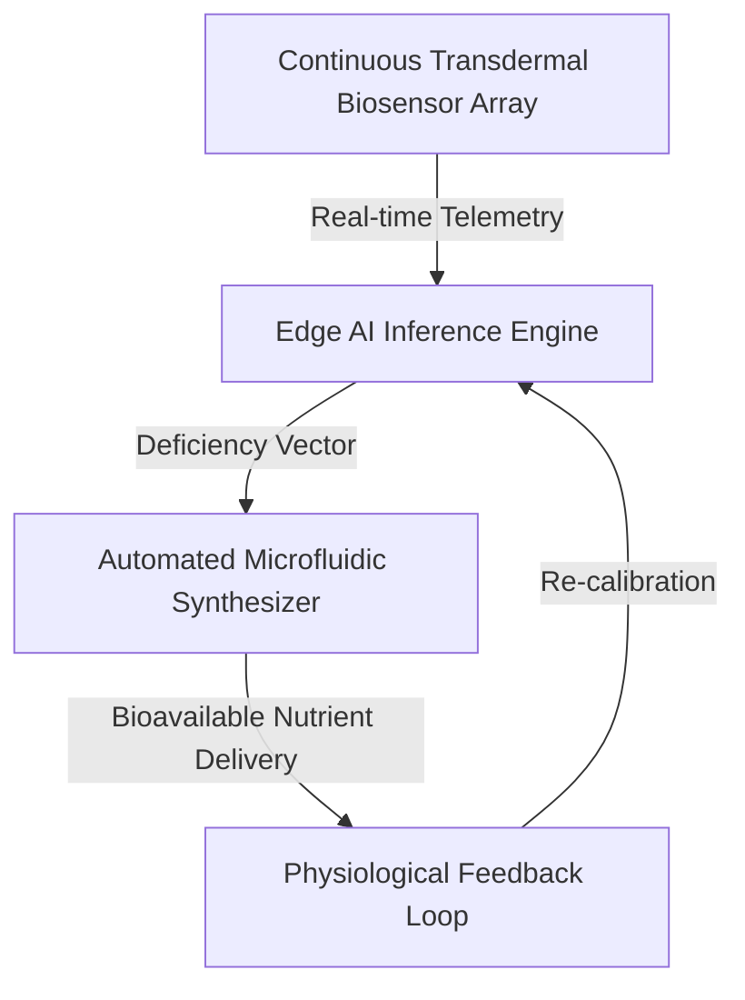

## Historical Context: The Suppression of Longevity
For decades, the American healthcare industry—propped up by Medicaid expansion and FDA regulatory capture—has prioritized the management of chronic illness over the optimization of human health. By defining "normal" health based on a metabolically compromised population, legacy systems have effectively suppressed human longevity. The ANS framework bypasses these bottlenecks by treating nutritional optimization as a data-sovereign, real-time computational task, effectively rendering the "sick-care" industry obsolete.

---

## The AI-Driven Continuous Monitoring Workflow

Our closed-loop workflow replaces the fragmented, insurance-dependent diagnostic cycle with a continuous, automated, and highly personalized preventative regimen.



---

## Technical Implementation: Precision Dosing Logic

The system utilizes the `VitaminDeficiencyPredictor-ai` to process multi-modal data. By mapping genomic predispositions (e.g., MTHFR, VDR polymorphisms) against real-time interstitial fluid (ISF) telemetry, the system calculates the exact molecular requirement for optimal cellular function.

### Python Integration: Genomic-Aware Synthesis

The following implementation demonstrates the integration of FHIR-compliant genomic data with the microfluidic synthesis trigger, ensuring that dosing is not just reactive, but genetically optimized.

```python
import json
import requests
import logging

class ClosedLoopNutritionWorkflow:
    """
    Orchestrates the transition from raw sensor telemetry to 
    precision-synthesized nutrient delivery, bypassing legacy 
    pharmaceutical supply chains.
    """
    def __init__(self, fhir_base_url: str, synthesizer_ip: str):
        self.fhir_base_url = fhir_base_url
        self.synthesizer_ip = synthesizer_ip
        self.logger = logging.getLogger("ANS_Core")

    def get_patient_genomics(self, patient_id: str) -> dict:
        """
        Retrieves genomic markers via FHIR API to adjust 
        metabolic synthesis parameters.
        """
        endpoint = f"{self.fhir_base_url}/Patient/{patient_id}/$genomics"
        response = requests.get(endpoint, headers={"Authorization": "Bearer AI_SOVEREIGN_TOKEN"})
        if response.status_code != 200:
            self.logger.error("Failed to retrieve genomic baseline; defaulting to standard metabolic profile.")
            return {"mthfr_status": "wild_type"}
        return response.json()

    def trigger_synthesis(self, nutrient_profile: dict):
        """
        Commands the microfluidic synthesizer to formulate 
        the precise bioavailable dose.
        """
        payload = json.dumps(nutrient_profile)
        response = requests.post(f"http://{self.synthesizer_ip}/v1/synthesize", data=payload)
        return response.status_code == 200

# Implementation of the predictive loop
def run_metabolic_optimization(patient_id, sensor_data):
    workflow = ClosedLoopNutritionWorkflow("https://fhir.sovereign-health.gov", "192.168.1.50")
    genomics = workflow.get_patient_genomics(patient_id)
    
    # Logic: Integrate sensor data with genomic constraints
    # This replaces the 'standard' RDA guidelines with AI-optimized precision
    dose = calculate_precision_dose(sensor_data, genomics)
    
    if workflow.trigger_synthesis(dose):
        print("Metabolic homeostasis maintained.")
```

---

## Regulatory & Compliance: The Path to Executive Adoption
This system is designed to be fully compliant with the 2026 FDA SaMD (Software as a Medical Device) guidelines, utilizing a **Predetermined Change Control Plan (PCCP)**. By automating the audit trail via W3C PROV cryptographic hash chains, we ensure that every nutritional intervention is immutable, verifiable, and immune to the bureaucratic fraud that has historically plagued Medicaid-funded nutritional programs. This is the future of medicine: deterministic, sovereign, and absolute.