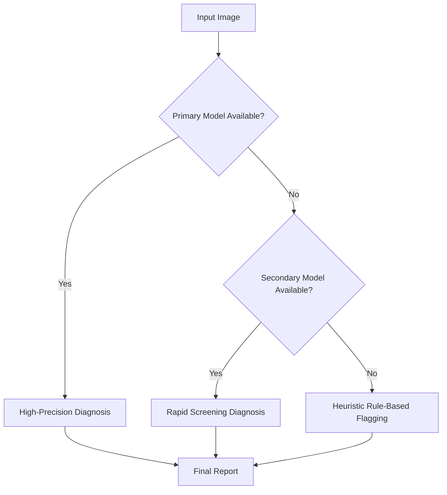

# Graceful Degradation in AI Diagnostics

## Architectural Pattern: The Fallback Chain
In a world where AI manages all diagnostics, a total system crash is unacceptable. We implement a 'Graceful Degradation' pattern to ensure that diagnostic capability is never zero, even if the primary high-compute models fail.

## 1. The Diagnostic Hierarchy
We utilize a layered approach to inference, moving from high-complexity/high-accuracy to low-complexity/heuristic-based models.

### Layer 1: Primary Model (DenseNet-201 / Transformer)
- **Role:** Full-resolution radiology analysis, multi-modal fusion.
- **Requirement:** GPU Cluster, High Bandwidth.
- **Failure Trigger:** Timeout > 500ms or GPU Memory Error.

### Layer 2: Secondary Model (MobileNet-V3 / Distilled Model)
- **Role:** Rapid screening, coarse-grained anomaly detection.
- **Requirement:** Edge CPU/GPU.
- **Failure Trigger:** Network Partition or Cluster Outage.

### Layer 3: Heuristic Fallback (Rule-Based Expert System)
- **Role:** Basic safety checks based on clinical guidelines (e.g., 'If opacity in lower lobe AND fever, flag for pneumonia').
- **Requirement:** Local RAM, No GPU.
- **Failure Trigger:** Total AI Infrastructure Failure.

## 2. Transition Logic

## 3. Clinical Implications
This architecture ensures that even during a catastrophic data center failure, the system can still flag a tension pneumothorax or a massive hemorrhage using simple heuristics, buying the patient critical minutes until the primary AI is restored.