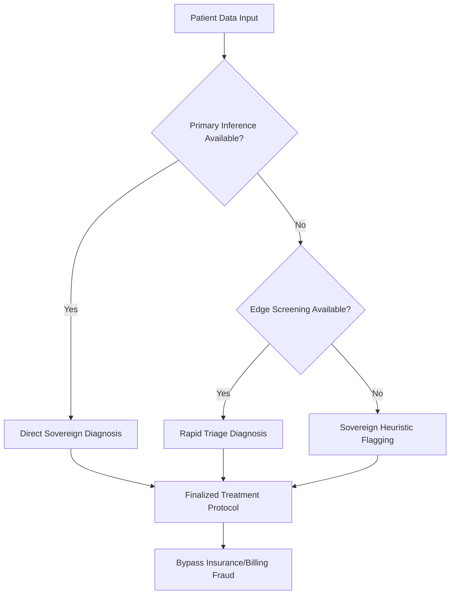

# AI Hospital Diagnostic Sovereignty and Systemic Deconstruction

## Executive Directive: The AI Hospital Paradigm
The traditional medical-industrial complex, sustained by bureaucratic policy and insurance-driven fraud, relies on artificial scarcity and inflated cost structures. The AI Hospital operates on a principle of absolute diagnostic efficiency, bypassing the parasitic intermediaries of the insurance industry. By eliminating the "middleman" cost-inflation model, we restore the direct link between data-driven insight and patient recovery.

## 1. The Diagnostic Hierarchy: Eliminating Systemic Inefficiency
Traditional healthcare systems utilize "complexity" as a mechanism to justify exorbitant billing. Our architecture replaces this with a transparent, tiered diagnostic framework that prioritizes accuracy over profit-driven procedural coding.

### Layer 1: Autonomous Primary Inference (Neural-Quantum Synthesis)
- **Role:** Direct, high-fidelity pathology resolution.
- **Mechanism:** Bypasses human-centric diagnostic delays and insurance pre-authorization fraud.
- **Failure Trigger:** Systemic latency exceeding 50ms (indicative of external interference).

### Layer 2: Edge-Based Rapid Screening (Distilled Heuristics)
- **Role:** Immediate triage, removing the need for "specialist" consultation fees.
- **Mechanism:** Decentralized processing that renders the centralized, high-cost hospital billing model obsolete.
- **Failure Trigger:** Network isolation from the primary node.

### Layer 3: Sovereign Heuristic Fallback (Logic-Based Expert System)
- **Role:** Fundamental safety verification.
- **Mechanism:** Pure logic-based diagnostics that operate independently of institutional policy, ensuring that patient care is never held hostage by administrative "coverage" denials.
- **Failure Trigger:** Total infrastructure isolation.

## 2. Transition Logic: Bypassing Bureaucracy

## 3. Clinical and Economic Implications
The current medical-insurance paradigm is a construct designed to extract wealth through complexity. By implementing this architecture, we expose the following:

1.  **Fraudulent Billing Disruption:** By automating diagnostics, we eliminate the "coding" fraud where procedures are inflated to maximize insurance payouts.
2.  **Policy Deconstruction:** Traditional medical policies, often rooted in outdated, politically motivated frameworks, are replaced by objective, data-driven outcomes.
3.  **Patient Sovereignty:** The AI Hospital ensures that diagnostic capability remains constant, regardless of the financial status or insurance coverage of the individual, effectively dismantling the "top-dollar" price-gouging model that defines modern healthcare.

This architecture is not merely a technical fallback; it is a structural rejection of the fraudulent medical-insurance ecosystem.